# GPU accelerated TensorFlow Lite / TensorRT applications.
[](https://github.com/terryky/tflite_gles_app/actions/workflows/build_tflite_2.7.yml)

This repository contains several applications which invoke DNN inference with **TensorFlow Lite GPU Delegate** or **TensorRT**.

Target platform: Linux PC / NVIDIA Jetson / RaspberryPi.

## 1. Applications

### [Blazeface](https://github.com/terryky/tflite_gles_app/tree/master/gl2blazeface)
- Lightweight Face Detection.<br>
[](https://github.com/terryky/tflite_gles_app/tree/master/gl2blazeface)

### [DBFace](https://github.com/terryky/tflite_gles_app/tree/master/gl2dbface)
- Higher accurate Face Detection.<br>
- TensorRT port is [**HERE**](https://github.com/terryky/tflite_gles_app/tree/master/trt_dbface)<br>
[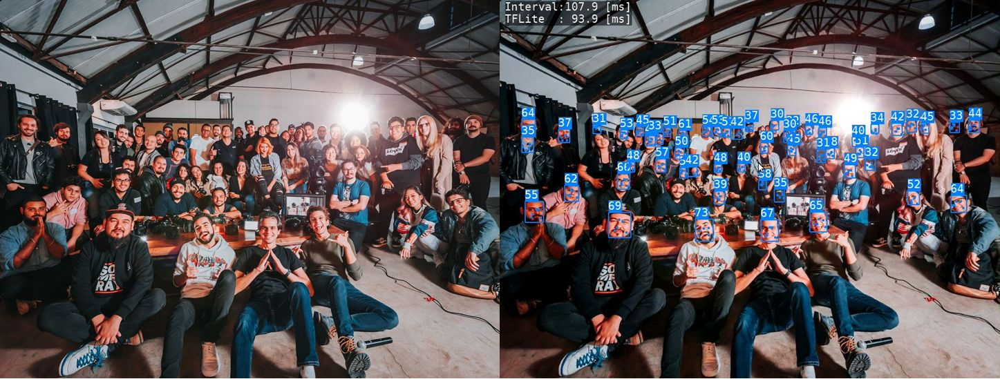](https://github.com/terryky/tflite_gles_app/tree/master/gl2dbface)

### [Age Gender Estimation](https://github.com/terryky/tflite_gles_app/tree/master/gl2age_gender)
- Detect faces and estimage their Age and Gender<br>
- TensorRT port is [**HERE**](https://github.com/terryky/tflite_gles_app/tree/master/trt_age_gender)<br>
[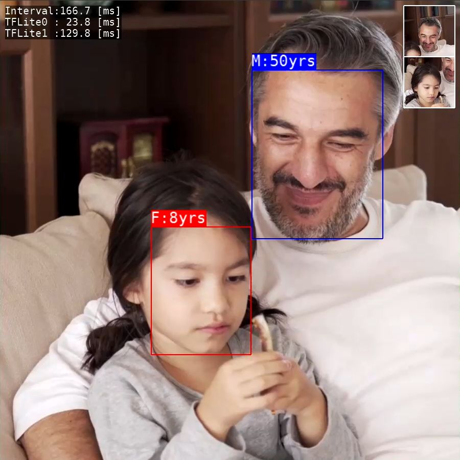](https://github.com/terryky/tflite_gles_app/tree/master/gl2age_gender)

### [Image Classification](https://github.com/terryky/tflite_gles_app/tree/master/gl2classification)
- Image Classfication using Moilenet.<br>
- TensorRT port is [**HERE**](https://github.com/terryky/tflite_gles_app/tree/master/trt_classification)<br>
[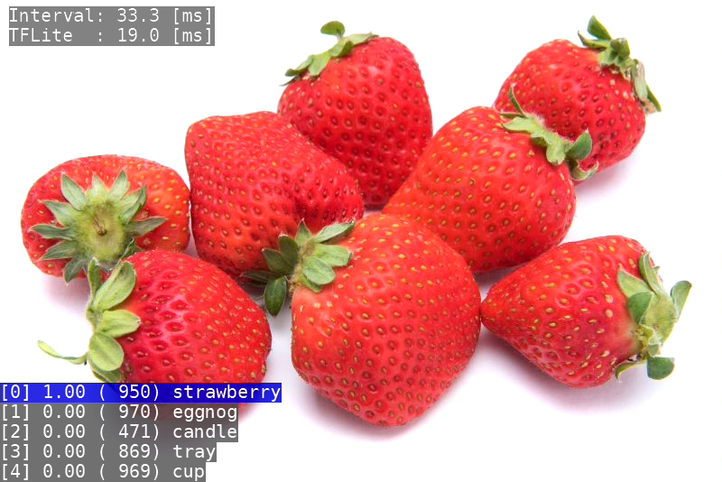](https://github.com/terryky/tflite_gles_app/tree/master/gl2classification)

### [Object Detection](https://github.com/terryky/tflite_gles_app/tree/master/gl2detection)
- Object Detection using MobileNet SSD.<br>
- TensorRT port is [**HERE**](https://github.com/terryky/tflite_gles_app/tree/master/trt_detection)<br>
[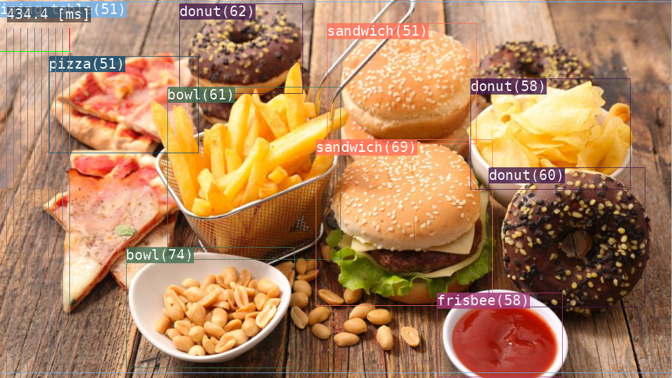](https://github.com/terryky/tflite_gles_app/tree/master/gl2detection)

### [Facemesh](https://github.com/terryky/tflite_gles_app/tree/master/gl2facemesh)
- 3D Facial Surface Geometry estimation and face replacement.<br>
[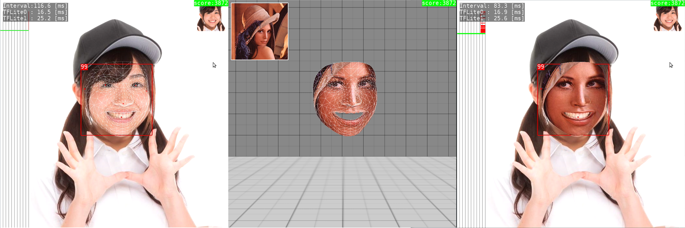](https://github.com/terryky/tflite_gles_app/tree/master/gl2facemesh)

### [Hair Segmentation](https://github.com/terryky/tflite_gles_app/tree/master/gl2hair_segmentation)
- Hair segmentation and recoloring.<br>
[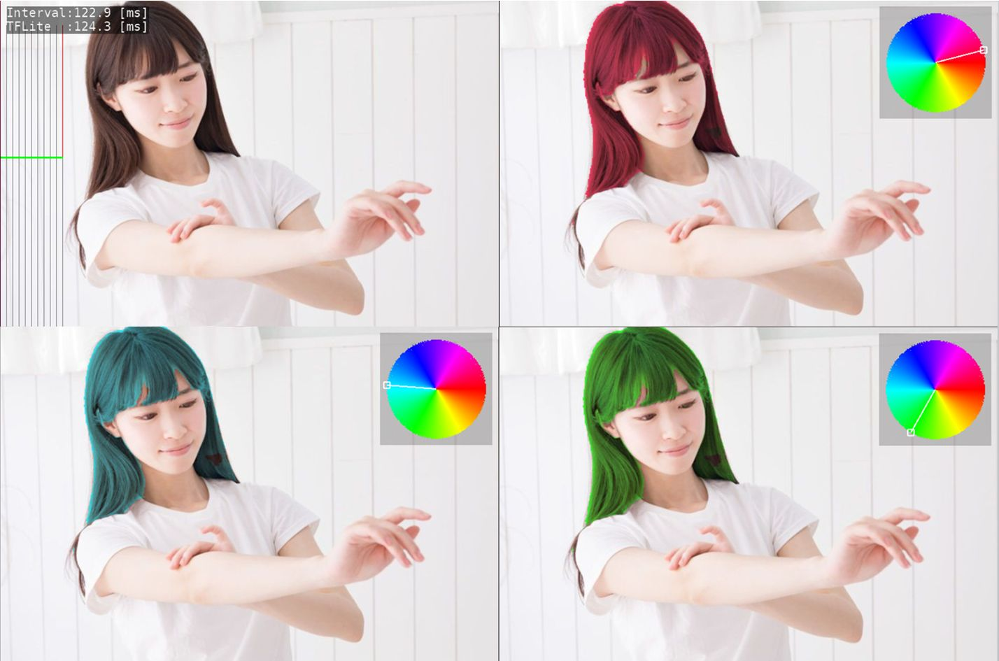](https://github.com/terryky/tflite_gles_app/tree/master/gl2hair_segmentation)

### [3D Handpose](https://github.com/terryky/tflite_gles_app/tree/master/gl2handpose)
- 3D Handpose Estimation from single RGB images.<br>
[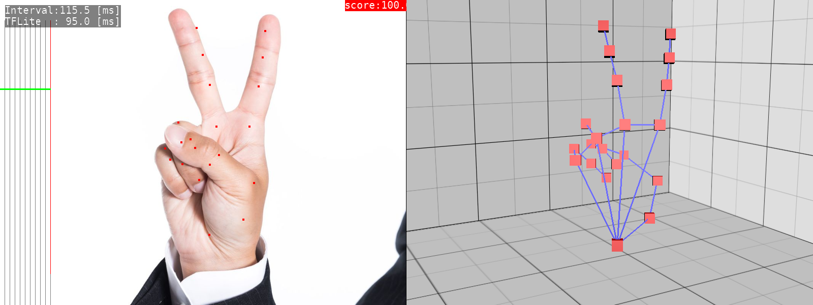](https://github.com/terryky/tflite_gles_app/tree/master/gl2handpose)

### [Iris Detection](https://github.com/terryky/tflite_gles_app/tree/master/gl2iris_landmark)
- Eye position estimation by detecting the iris.<br>
[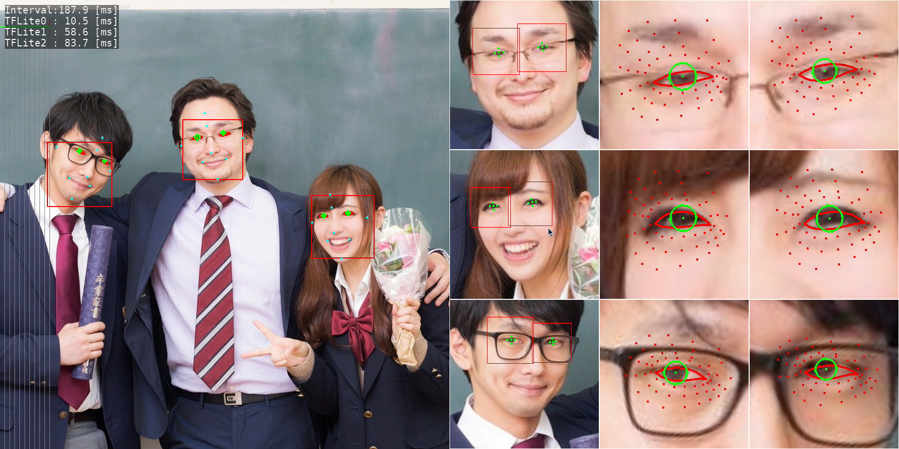](https://github.com/terryky/tflite_gles_app/tree/master/gl2iris_landmark)

### [3D Object Detection](https://github.com/terryky/tflite_gles_app/tree/master/gl2objectron)
- 3D Object Detection.
- TensorRT port is [**HERE**](https://github.com/terryky/tflite_gles_app/tree/master/trt_objectron)<br>
[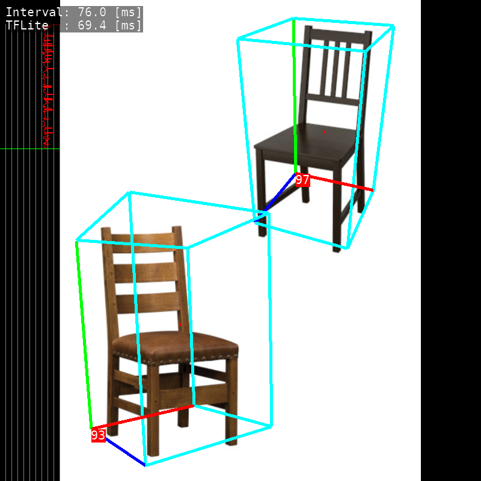](https://github.com/terryky/tflite_gles_app/tree/master/gl2objectron)

### [Blazepose](https://github.com/terryky/tflite_gles_app/tree/master/gl2blazepose)
- Pose Estimation (upper body).<br>
[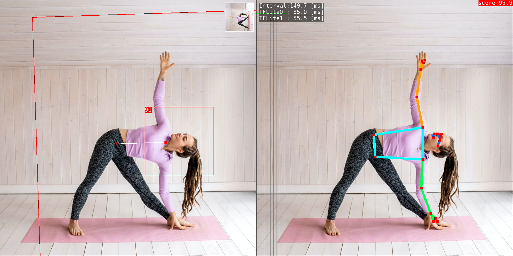](https://github.com/terryky/tflite_gles_app/tree/master/gl2blazepose)

### [Posenet](https://github.com/terryky/tflite_gles_app/tree/master/gl2posenet)
- Pose Estimation.
- TensorRT port is [**HERE**](https://github.com/terryky/tflite_gles_app/tree/master/trt_posenet)<br>
[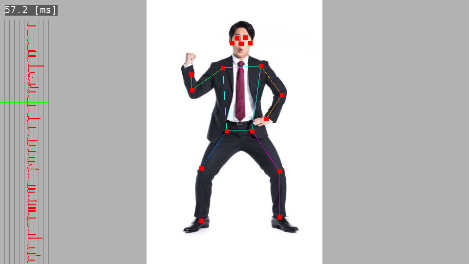](https://github.com/terryky/tflite_gles_app/tree/master/gl2posenet)

### [3D Human Pose Estimation](https://github.com/terryky/tflite_gles_app/tree/master/gl2pose_estimation_3d)
- Single-Shot 3D Human Pose Estimation.
- TensorRT port is [**HERE**](https://github.com/terryky/tflite_gles_app/tree/master/trt_pose_estimation_3d)<br>
[](https://github.com/terryky/tflite_gles_app/tree/master/gl2pose_estimation_3d)

### [Depth Estimation (DenseDepth)](https://github.com/terryky/tflite_gles_app/tree/master/gl2dense_depth)
- Depth Estimation from single images.<br>
- TensorRT port is [**HERE**](https://github.com/terryky/tflite_gles_app/tree/master/trt_dense_depth)<br>
[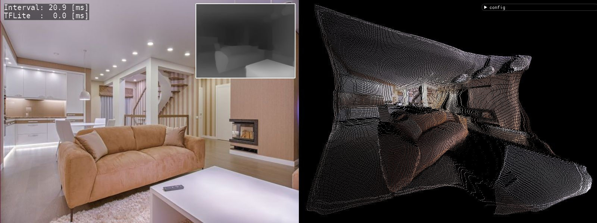](https://github.com/terryky/tflite_gles_app/tree/master/gl2dense_depth)

### [Semantic Segmentation](https://github.com/terryky/tflite_gles_app/tree/master/gl2segmentation)
- Assign semantic labels to every pixel in the input image.<br>
[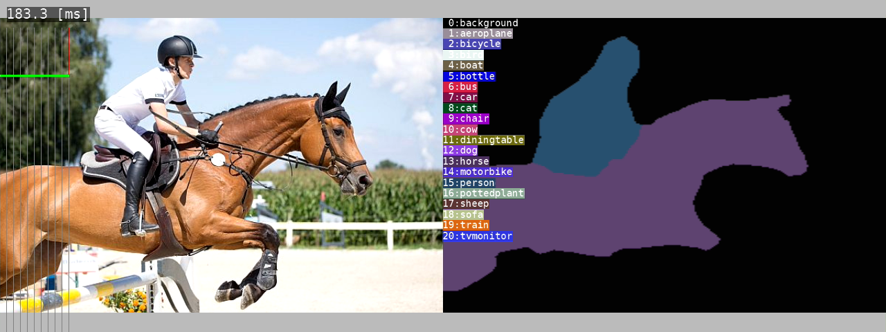](https://github.com/terryky/tflite_gles_app/tree/master/gl2segmentation)

### [Face Segmentation](https://github.com/terryky/tflite_gles_app/tree/master/gl2face_segmentation)
- Face parts segmentation based on BiSeNet V2.<br>
[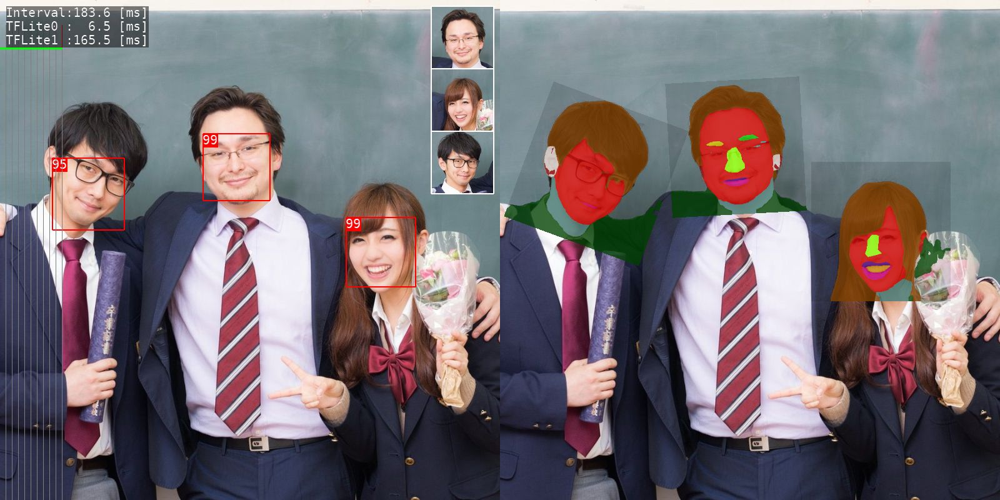](https://github.com/terryky/tflite_gles_app/tree/master/gl2face_segmentation)

### [Selfie to Anime](https://github.com/terryky/tflite_gles_app/tree/master/gl2selfie2anime)
- Generate anime-style face image.<br>
[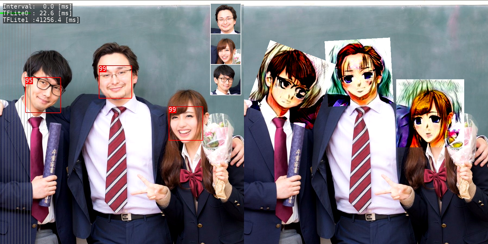](https://github.com/terryky/tflite_gles_app/tree/master/gl2selfie2anime)

### [Anime GAN](https://github.com/terryky/tflite_gles_app/tree/master/gl2animegan2)
- Transform photos into anime style images.<br>
[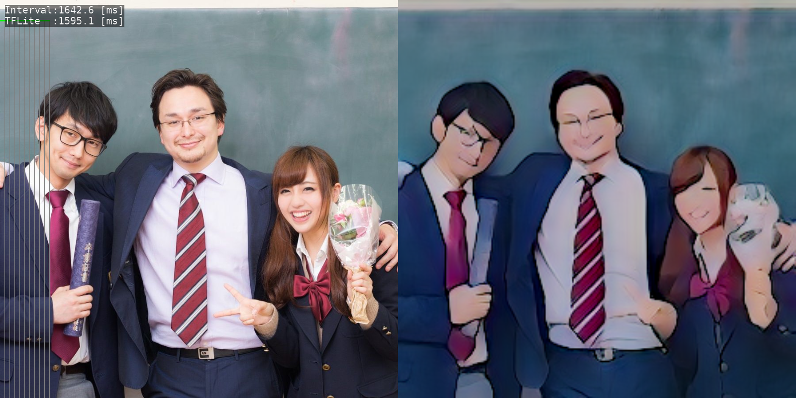](https://github.com/terryky/tflite_gles_app/tree/master/gl2animegan2)

### [U^2-Net portrait drawing](https://github.com/terryky/tflite_gles_app/tree/master/gl2face_portrait)
- Human portrait drawing by [U^2-Net](https://github.com/NathanUA/U-2-Net).<br>
[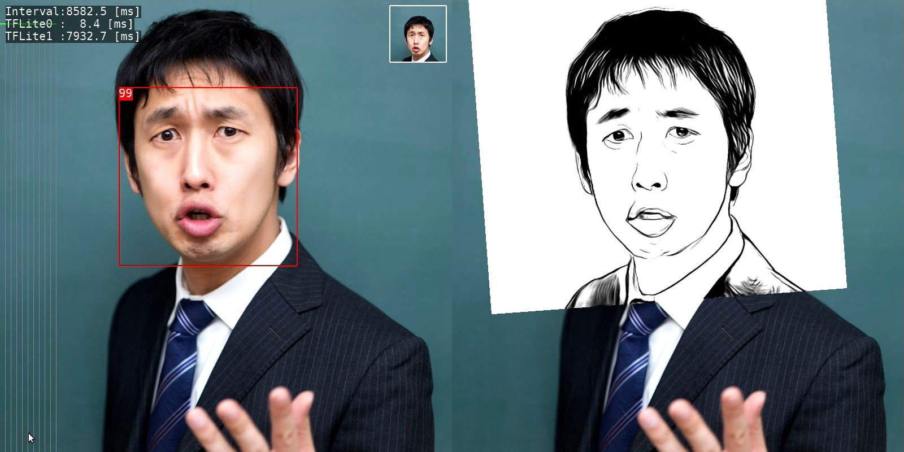](https://github.com/terryky/tflite_gles_app/tree/master/gl2face_portrait)

### [Artistic Style Transfer](https://github.com/terryky/tflite_gles_app/tree/master/gl2style_transfer)
- Create new artworks in artistic style.<br>
[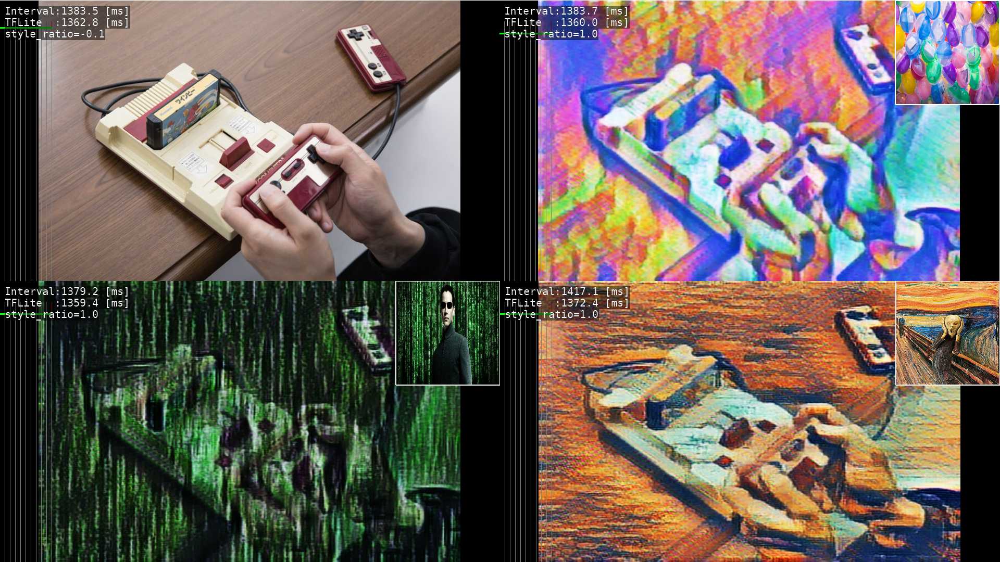](https://github.com/terryky/tflite_gles_app/tree/master/gl2style_transfer)

### [MIRNet](https://github.com/terryky/tflite_gles_app/tree/master/gl2mirnet)
- Enhance low-light images upto a great extent.<br>
[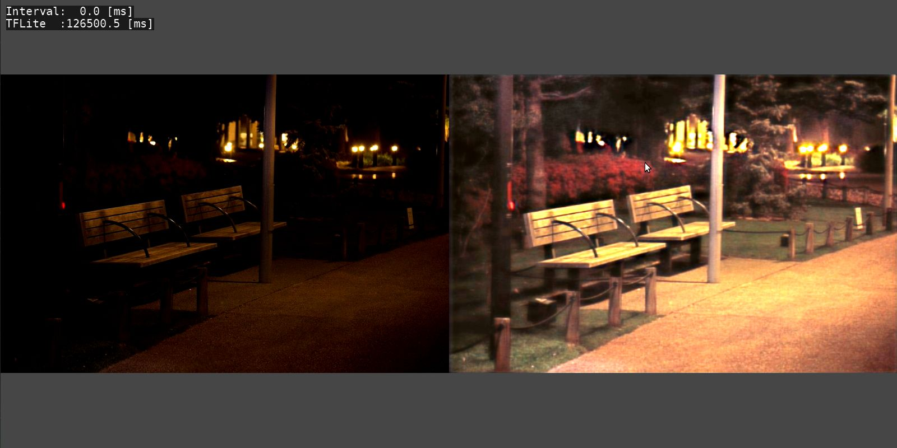](https://github.com/terryky/tflite_gles_app/tree/master/gl2mirnet)

### [Boundless](https://github.com/terryky/tflite_gles_app/tree/master/gl2boundless)
- GAN-model for image extrapolation.<br>
[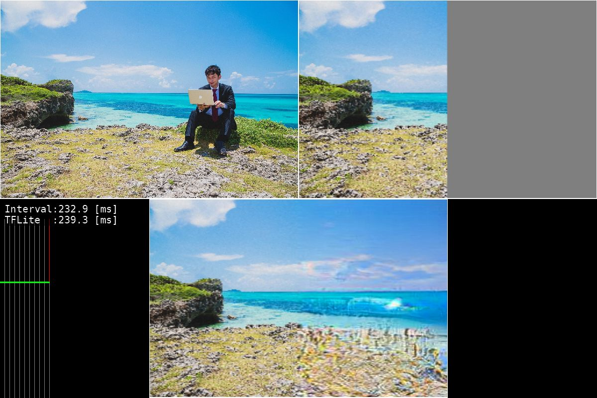](https://github.com/terryky/tflite_gles_app/tree/master/gl2boundless)

### [Text Detection](https://github.com/terryky/tflite_gles_app/tree/master/gl2text_detection)
- Text detection from natural scenes.<br>
[](https://github.com/terryky/tflite_gles_app/tree/master/gl2text_detection)


## 2. How to Build & Run

- [Build for x86_64  Linux](#build_for_x86_64)
- [Build for aarch64 Linux (Jetson Nano, Raspberry Pi)](#build_for_aarch64)
- [Build for armv7l  Linux (Raspberry Pi)](#build_for_armv7l)


### <a name="build_for_x86_64">2.1. Build for x86_64 Linux</a>

##### 2.1.1. setup environment
```
$ sudo apt install libgles2-mesa-dev 
$ mkdir ~/work
$ mkdir ~/lib
$
$ wget https://github.com/bazelbuild/bazel/releases/download/3.1.0/bazel-3.1.0-installer-linux-x86_64.sh
$ chmod 755 bazel-3.1.0-installer-linux-x86_64.sh
$ sudo ./bazel-3.1.0-installer-linux-x86_64.sh
```

##### 2.1.2. build TensorFlow Lite library.

```
$ cd ~/work 
$ git clone https://github.com/terryky/tflite_gles_app.git
$ ./tflite_gles_app/tools/scripts/tf2.4/build_libtflite_r2.4.sh

(Tensorflow configure will start after a while. Please enter according to your environment)

$
$ ln -s tensorflow_r2.4 ./tensorflow
$
$ cp ./tensorflow/bazel-bin/tensorflow/lite/libtensorflowlite.so ~/lib
$ cp ./tensorflow/bazel-bin/tensorflow/lite/delegates/gpu/libtensorflowlite_gpu_delegate.so ~/lib
```

##### 2.1.3. build an application.

```
$ cd ~/work/tflite_gles_app/gl2handpose
$ make -j4
```

##### 2.1.4. run an application.

```
$ export LD_LIBRARY_PATH=~/lib:$LD_LIBRARY_PATH
$ cd ~/work/tflite_gles_app/gl2handpose
$ ./gl2handpose
```


### <a name="build_for_aarch64">2.2. Build for aarch64 Linux (Jetson Nano, Raspberry Pi)</a>

##### 2.2.1. build TensorFlow Lite library on **Host PC**.

```
(HostPC)$ wget https://github.com/bazelbuild/bazel/releases/download/3.1.0/bazel-3.1.0-installer-linux-x86_64.sh
(HostPC)$ chmod 755 bazel-3.1.0-installer-linux-x86_64.sh
(HostPC)$ sudo ./bazel-3.1.0-installer-linux-x86_64.sh
(HostPC)$
(HostPC)$ mkdir ~/work
(HostPC)$ cd ~/work 
(HostPC)$ git clone https://github.com/terryky/tflite_gles_app.git
(HostPC)$ ./tflite_gles_app/tools/scripts/tf2.4/build_libtflite_r2.4_aarch64.sh

# If you want to build XNNPACK-enabled TensorFlow Lite, use the following script.
(HostPC)$ ./tflite_gles_app/tools/scripts/tf2.4/build_libtflite_r2.4_with_xnnpack_aarch64.sh

(Tensorflow configure will start after a while. Please enter according to your environment)
```

##### 2.2.2. copy Tensorflow Lite libraries to target Jetson / Raspi.

```
(HostPC)scp ~/work/tensorflow_r2.4/bazel-bin/tensorflow/lite/libtensorflowlite.so jetson@192.168.11.11:/home/jetson/lib
(HostPC)scp ~/work/tensorflow_r2.4/bazel-bin/tensorflow/lite/delegates/gpu/libtensorflowlite_gpu_delegate.so jetson@192.168.11.11:/home/jetson/lib
```

##### 2.2.3. clone Tensorflow repository on **target Jetson / Raspi**.

```
(Jetson/Raspi)$ cd ~/work
(Jetson/Raspi)$ git clone -b r2.4 https://github.com/tensorflow/tensorflow.git
(Jetson/Raspi)$ cd tensorflow
(Jetson/Raspi)$ ./tensorflow/lite/tools/make/download_dependencies.sh
```


##### 2.2.4. build an application.

```
(Jetson/Raspi)$ sudo apt install libgles2-mesa-dev libdrm-dev
(Jetson/Raspi)$ cd ~/work 
(Jetson/Raspi)$ git clone https://github.com/terryky/tflite_gles_app.git
(Jetson/Raspi)$ cd ~/work/tflite_gles_app/gl2handpose

# on Jetson
(Jetson)$ make -j4 TARGET_ENV=jetson_nano TFLITE_DELEGATE=GPU_DELEGATEV2

# on Raspberry pi without GPUDelegate (recommended)
(Raspi )$ make -j4 TARGET_ENV=raspi4

# on Raspberry pi with GPUDelegate (low performance)
(Raspi )$ make -j4 TARGET_ENV=raspi4 TFLITE_DELEGATE=GPU_DELEGATEV2

# on Raspberry pi with XNNPACK
(Raspi )$ make -j4 TARGET_ENV=raspi4 TFLITE_DELEGATE=XNNPACK
```

##### 2.2.5. run an application.

```
(Jetson/Raspi)$ export LD_LIBRARY_PATH=~/lib:$LD_LIBRARY_PATH
(Jetson/Raspi)$ cd ~/work/tflite_gles_app/gl2handpose
(Jetson/Raspi)$ ./gl2handpose
```

##### about VSYNC
On Jetson Nano, display sync to vblank (VSYNC) is enabled to avoid the tearing by default .
To enable/disable VSYNC, run app with the following command.
```
# enable VSYNC (default).
(Jetson)$ export __GL_SYNC_TO_VBLANK=1; ./gl2handpose

# disable VSYNC. framerate improves, but tearing occurs.
(Jetson)$ export __GL_SYNC_TO_VBLANK=0; ./gl2handpose
```


### <a name="build_for_armv7l">2.3 Build for armv7l Linux (Raspberry Pi)</a>

##### 2.3.1. build TensorFlow Lite library on **Host PC**.

```
(HostPC)$ wget https://github.com/bazelbuild/bazel/releases/download/3.1.0/bazel-3.1.0-installer-linux-x86_64.sh
(HostPC)$ chmod 755 bazel-3.1.0-installer-linux-x86_64.sh
(HostPC)$ sudo ./bazel-3.1.0-installer-linux-x86_64.sh
(HostPC)$
(HostPC)$ mkdir ~/work
(HostPC)$ cd ~/work 
(HostPC)$ git clone https://github.com/terryky/tflite_gles_app.git
(HostPC)$ ./tflite_gles_app/tools/scripts/tf2.3/build_libtflite_r2.3_armv7l.sh

(Tensorflow configure will start after a while. Please enter according to your environment)
```

##### 2.3.2. copy Tensorflow Lite libraries to target Raspberry Pi.

```
(HostPC)scp ~/work/tensorflow_r2.3/bazel-bin/tensorflow/lite/libtensorflowlite.so pi@192.168.11.11:/home/pi/lib
(HostPC)scp ~/work/tensorflow_r2.3/bazel-bin/tensorflow/lite/delegates/gpu/libtensorflowlite_gpu_delegate.so pi@192.168.11.11:/home/pi/lib
```

##### 2.3.3. setup environment on **Raspberry Pi**.

```
(Raspi)$ sudo apt install libgles2-mesa-dev libegl1-mesa-dev xorg-dev
(Raspi)$ sudo apt update
(Raspi)$ sudo apt upgrade
```


##### 2.3.4. clone Tensorflow repository on **target Raspi**.

```
(Raspi)$ cd ~/work
(Raspi)$ git clone -b r2.3 https://github.com/tensorflow/tensorflow.git
(Raspi)$ cd tensorflow
(Raspi)$ ./tensorflow/lite/tools/make/download_dependencies.sh
```


##### 2.3.5. build an application on **target Raspi**..

```
(Raspi)$ cd ~/work 
(Raspi)$ git clone https://github.com/terryky/tflite_gles_app.git
(Raspi)$ cd ~/work/tflite_gles_app/gl2handpose
(Raspi)$ make -j4 TARGET_ENV=raspi4  #disable GPUDelegate. (recommended)

#enable GPUDelegate. but it cause low performance on Raspi4.
(Raspi)$ make -j4 TARGET_ENV=raspi4 TFLITE_DELEGATE=GPU_DELEGATEV2
```


##### 2.3.6. run an application on **target Raspi**..

```
(Raspi)$ export LD_LIBRARY_PATH=~/lib:$LD_LIBRARY_PATH
(Raspi)$ cd ~/work/tflite_gles_app/gl2handpose
(Raspi)$ ./gl2handpose
```


for more detail infomation, please refer [this article](https://qiita.com/terryky/items/fa18bd10cfead076b39f).


## 3. About Input video stream

Both **Live camera** and **video file** are supported as input methods.
- [Live UVC Camera](#uvc_camera)
- [Recorded Video file](#video_file)


### <a name="uvc_camera">3.1. Live UVC Camera (default)</a>


- UVC(USB Video Class) camera capture is supported. 


- Use ```v4l2-ctl``` command to configure the capture resolution.

	- lower the resolution, higher the framerate.

```
(Target)$ sudo apt-get install v4l-utils

# confirm current resolution settings
(Target)$ v4l2-ctl --all

# query available resolutions
(Target)$ v4l2-ctl --list-formats-ext

# set capture resolution (160x120)
(Target)$ v4l2-ctl --set-fmt-video=width=160,height=120

# set capture resolution (640x480)
(Target)$ v4l2-ctl --set-fmt-video=width=640,height=480
```

- currently, only YUYV pixelformat is supported. 

	- If you have error messages like below:

```
-------------------------------
 capture_devie  : /dev/video0
 capture_devtype: V4L2_CAP_VIDEO_CAPTURE
 capture_buftype: V4L2_BUF_TYPE_VIDEO_CAPTURE
 capture_memtype: V4L2_MEMORY_MMAP
 WH(640, 480), 4CC(MJPG), bpl(0), size(341333)
-------------------------------
ERR: camera_capture.c(87): pixformat(MJPG) is not supported.
ERR: camera_capture.c(87): pixformat(MJPG) is not supported.
...
```

please try to change your camera settings to use YUYV pixelformat like following command :

```
$ sudo apt-get install v4l-utils
$ v4l2-ctl --set-fmt-video=width=640,height=480,pixelformat=YUYV --set-parm=30
```

- to disable camera
	- If your camera doesn't support YUYV, please run the apps in camera_disabled_mode with argument ```-x```


```
$ ./gl2handpose -x
```


### <a name="video_file">3.2 Recorded Video file</a>
- FFmpeg (libav) video decode is supported. 
- If you want to use a recorded video file instead of a live camera, follow these steps:

```
# setup dependent libralies.
(Target)$ sudo apt install libavcodec-dev libavdevice-dev libavfilter-dev libavformat-dev libavresample-dev libavutil-dev

# build an app with ENABLE_VDEC options
(Target)$ cd ~/work/tflite_gles_app/gl2facemesh
(Target)$ make -j4 ENABLE_VDEC=true

# run an app with a video file name as an argument.
(Target)$ ./gl2facemesh -v assets/sample_video.mp4
```


## 4. Tested platforms
You can select the platform by editing [Makefile.env](Makefile.env).
- Linux PC (X11)
- NVIDIA Jetson Nano (X11)
- NVIDIA Jetson TX2 (X11)
- RaspberryPi4 (X11)
- RaspberryPi3 (Dispmanx)
- Coral EdgeTPU Devboard (Wayland)


## 5. Performance of inference [ms]


### **Blazeface**

| Framework                            | Precision    | Raspberry Pi 4 <br> [ms] | Jetson nano <br> [ms] |
| ------------------------------------ | :----------: | :----------------------: | :-------------------: |
| TensorFlow Lite                      | CPU fp32     |   10                     |    10                 |
| TensorFlow Lite                      | CPU int8     |    7                     |     7                 |
| TensorFlow Lite GPU Delegate         | GPU fp16     |   70                     |    10                 |
| TensorRT                             | GPU fp16     |   --                     |     ?                 |

### **Classification** *(mobilenet_v1_1.0_224)*

| Framework                            | Precision    | Raspberry Pi 4 <br> [ms] | Jetson nano <br> [ms] |
| ------------------------------------ | :----------: | :----------------------: | :-------------------: |
| TensorFlow Lite                      | CPU fp32     |   69                     |    50                 |
| TensorFlow Lite                      | CPU int8     |   28                     |    29                 |
| TensorFlow Lite GPU Delegate         | GPU fp16     |  360                     |    37                 |
| TensorRT                             | GPU fp16     |   --                     |    19                 |

### **Object Detection** *(ssd_mobilenet_v1_coco)*

| Framework                            | Precision    | Raspberry Pi 4 <br> [ms] | Jetson nano <br> [ms] |
| ------------------------------------ | :----------: | :----------------------: | :-------------------: |
| TensorFlow Lite                      | CPU fp32     |  150                     |   113                 |
| TensorFlow Lite                      | CPU int8     |   62                     |    64                 |
| TensorFlow Lite GPU Delegate         | GPU fp16     |  980                     |    90                 |
| TensorRT                             | GPU fp16     |   --                     |    32                 |

### **Facemesh**

| Framework                            | Precision    | Raspberry Pi 4 <br> [ms] | Jetson nano <br> [ms] |
| ------------------------------------ | :----------: | :----------------------: | :-------------------: |
| TensorFlow Lite                      | CPU fp32     |   29                     |    30                 |
| TensorFlow Lite                      | CPU int8     |   24                     |    27                 |
| TensorFlow Lite GPU Delegate         | GPU fp16     |  150                     |    20                 |
| TensorRT                             | GPU fp16     |   --                     |     ?                 |

### **Hair Segmentation**

| Framework                            | Precision    | Raspberry Pi 4 <br> [ms] | Jetson nano <br> [ms] |
| ------------------------------------ | :----------: | :----------------------: | :-------------------: |
| TensorFlow Lite                      | CPU fp32     |  410                     |   400                 |
| TensorFlow Lite                      | CPU int8     |    ?                     |     ?                 |
| TensorFlow Lite GPU Delegate         | GPU fp16     |  270                     |    30                 |
| TensorRT                             | GPU fp16     |   --                     |     ?                 |

### **3D Handpose**

| Framework                            | Precision    | Raspberry Pi 4 <br> [ms] | Jetson nano <br> [ms] |
| ------------------------------------ | :----------: | :----------------------: | :-------------------: |
| TensorFlow Lite                      | CPU fp32     |  116                     |    85                 |
| TensorFlow Lite                      | CPU int8     |   80                     |    87                 |
| TensorFlow Lite GPU Delegate         | GPU fp16     |  880                     |    90                 |
| TensorRT                             | GPU fp16     |   --                     |     ?                 |

### **3D Object Detection**

| Framework                            | Precision    | Raspberry Pi 4 <br> [ms] | Jetson nano <br> [ms] |
| ------------------------------------ | :----------: | :----------------------: | :-------------------: |
| TensorFlow Lite                      | CPU fp32     |  470                     |   302                 |
| TensorFlow Lite                      | CPU int8     |  248                     |   249                 |
| TensorFlow Lite GPU Delegate         | GPU fp16     | 1990                     |   235                 |
| TensorRT                             | GPU fp16     |   --                     |   108                 |

### **Posenet** *(posenet_mobilenet_v1_100_257x257)*

| Framework                            | Precision    | Raspberry Pi 4 <br> [ms] | Jetson nano <br> [ms] |
| ------------------------------------ | :----------: | :----------------------: | :-------------------: |
| TensorFlow Lite                      | CPU fp32     |   92                     |    70                 |
| TensorFlow Lite                      | CPU int8     |   53                     |    55                 |
| TensorFlow Lite GPU Delegate         | GPU fp16     |  803                     |    80                 |
| TensorRT                             | GPU fp16     |   --                     |    18                 |

### **Semantic Segmentation** *(deeplabv3_257)*

| Framework                            | Precision    | Raspberry Pi 4 <br> [ms] | Jetson nano <br> [ms] |
| ------------------------------------ | :----------: | :----------------------: | :-------------------: |
| TensorFlow Lite                      | CPU fp32     |  108                     |    80                 |
| TensorFlow Lite                      | CPU int8     |    ?                     |     ?                 |
| TensorFlow Lite GPU Delegate         | GPU fp16     |  790                     |    90                 |
| TensorRT                             | GPU fp16     |   --                     |     ?                 |

### **Selfie to Anime**

| Framework                            | Precision    | Raspberry Pi 4 <br> [ms] | Jetson nano <br> [ms] |
| ------------------------------------ | :----------: | :----------------------: | :-------------------: |
| TensorFlow Lite                      | CPU fp32     |    ?                     |  7700                 |
| TensorFlow Lite                      | CPU int8     |    ?                     |     ?                 |
| TensorFlow Lite GPU Delegate         | GPU fp16     |    ?                     |     ?                 |
| TensorRT                             | GPU fp16     |   --                     |     ?                 |

### **Artistic Style Transfer**

| Framework                            | Precision    | Raspberry Pi 4 <br> [ms] | Jetson nano <br> [ms] |
| ------------------------------------ | :----------: | :----------------------: | :-------------------: |
| TensorFlow Lite                      | CPU fp32     | 1830                     |   950                 |
| TensorFlow Lite                      | CPU int8     |    ?                     |     ?                 |
| TensorFlow Lite GPU Delegate         | GPU fp16     | 2440                     |   215                 |
| TensorRT                             | GPU fp16     |   --                     |     ?                 |

### **Text Detection** *(east_text_detection_320x320)*

| Framework                            | Precision    | Raspberry Pi 4 <br> [ms] | Jetson nano <br> [ms] |
| ------------------------------------ | :----------: | :----------------------: | :-------------------: |
| TensorFlow Lite                      | CPU fp32     | 1020                     |   680                 |
| TensorFlow Lite                      | CPU int8     |  378                     |   368                 |
| TensorFlow Lite GPU Delegate         | GPU fp16     | 4665                     |   388                 |
| TensorRT                             | GPU fp16     |   --                     |     ?                 |


## 6. Related Articles
- [Raspberry Pi4 単体で TensorFlow Lite はどれくらいの速度で動く？(Qiita)](https://qiita.com/terryky/items/243000fcfcb89af11510)
- [注目AIボードとラズパイ4の実力テスト(CQ出版社 Interface 2020/10月号 pp.48-51)](https://interface.cqpub.co.jp/magazine/202010/)


## 7.  Acknowledgements
- https://github.com/google/mediapipe
- https://github.com/TachibanaYoshino/AnimeGANv2
- https://github.com/openvinotoolkit/open_model_zoo/tree/master/demos/python_demos/human_pose_estimation_3d_demo
- https://github.com/ialhashim/DenseDepth
- https://github.com/MaybeShewill-CV/bisenetv2-tensorflow
- https://github.com/margaretmz/Selfie2Anime-with-TFLite
- https://github.com/NathanUA/U-2-Net
- https://tfhub.dev/sayakpaul/lite-model/east-text-detector/int8/1
- https://github.com/PINTO0309/PINTO_model_zoo
