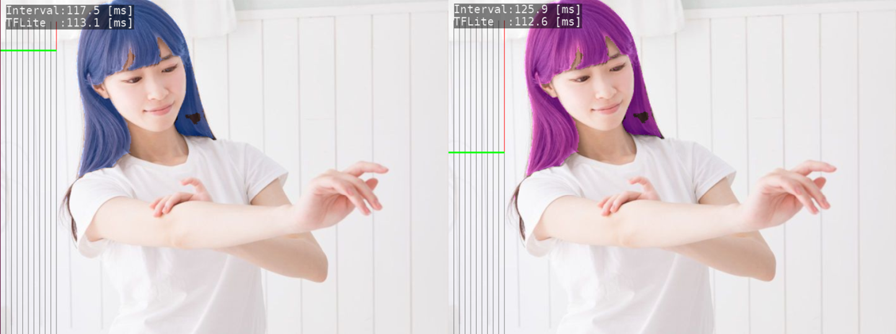

# gl2hair_segmentation
Hair segmentation and recoloring.
- This application use the pre-trained tflite model of [Google Mediapipe](https://github.com/google/mediapipe/tree/master/mediapipe/models).
- But this app directly call the TensorFlow Lite C++ api instead of  Mediapipe framework.

 
