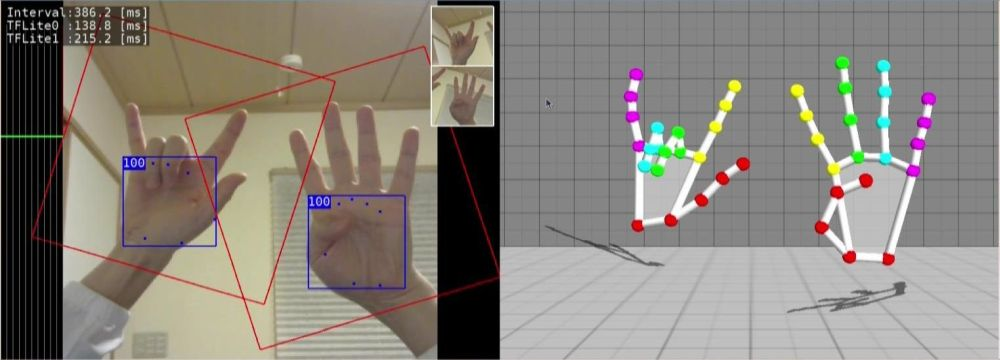

# gl2handpose
3D Hand Pose estimation from single RGB images.
- This application use the pre-trained tflite model of [Google Mediapipe](https://github.com/google/mediapipe/tree/master/mediapipe/models).
- But this app directly call the TensorFlow Lite C++ api instead of  Mediapipe framework.

## single hand mode (default)

```
$ ./gl2handpose
```

 


## multi hands mode.

```
$ ./gl2handpose -m
```

 


## use int8 quantized tflite for better performance.
```
# single hand mode
$ ./gl2handpose -q

or

# multi hands mode
$ ./gl2handpose -mq
```


### video of running on Jetson Nano
[youtube](https://www.youtube.com/watch?v=thwGxaIOHrs)
