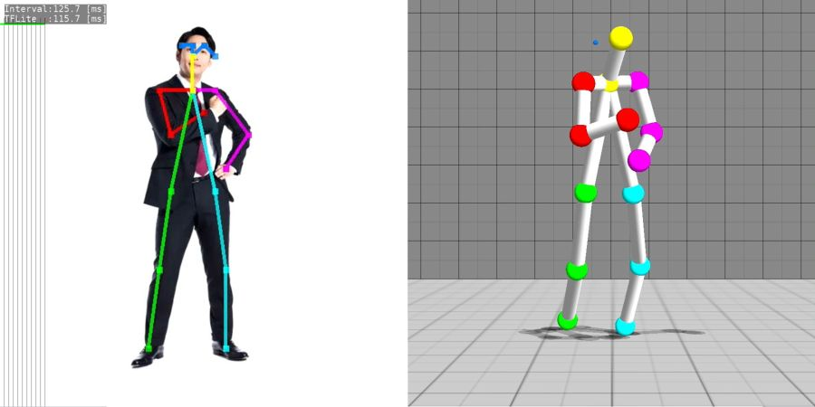
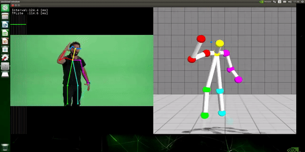

# gl2pose_estimation_3d
Single-Shot 3D Human Pose Estimation.
 - https://github.com/openvinotoolkit/open_model_zoo/tree/master/demos/python_demos/human_pose_estimation_3d_demo
 - https://github.com/PINTO0309/PINTO_model_zoo/tree/master/029_human-pose-estimation-3d-0001

 

#### stream input example

 

