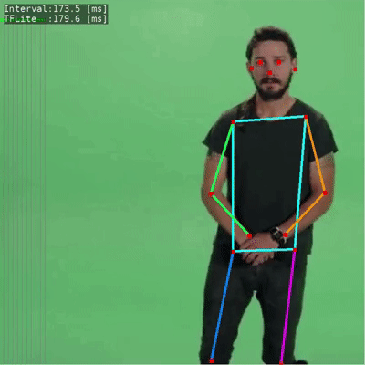
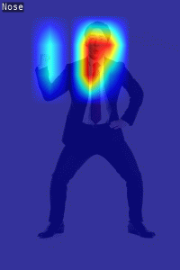

# gl2posenet
Estimate the pose of a person.
 - This application use the pre-trained tflite model of [Tensorflow models](https://www.tensorflow.org/lite/models/pose_estimation/overview).

 


## Visualize Heatmap
To visualize the heatmap of each keypoints, edit just one line.


```
"main.c"

#if 1
render_posenet_heatmap (draw_x, draw_y, draw_w, draw_h, &pose_ret);
#endif
```


## Particle rendering
To render particle fireballs at the estimated wrist position, edit just one line.


```
"main.c"
#define USE_FIREBALL_PARTICLE
```

