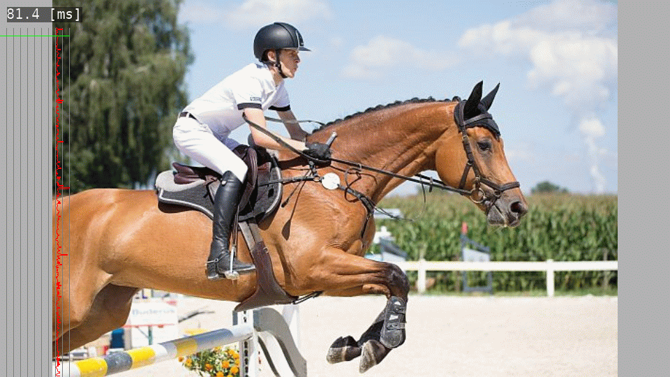

# gl2segmentation
TensorflowLite Semantic image segmentation application.
 - Load JPEG file as source image for pose estimation.
 - Invoke Tensorflow Lite with [Deeplab](https://www.tensorflow.org/lite/models/segmentation/overview).
 - visualize the result of detection.

 

## How to build
Before you build this application, you need to build the TensorFlow Lite C++ static library.

- 1) download the TensorFlow sourcecode from GitHub.
```
> cd ~/work/
> git clone https://github.com/tensorflow/tensorflow.git
> cd Tensorflow
> git checkout r1.13
```

- 2) download the dependent libraries.
```
> cd ~/work/tensorflow
> ./tensorflow/lite/tools/make/download_dependencies.sh
```

- 3) compile tensorflow lite library.
```
> cd ~/work/tensorflow
> make -f ./tensorflow/lite/tools/make/Makefile
```

- 4) and then, build application.
```
> cd ~/work/gles_app/gl2detection
> make
```

- 5) now you can run the application.
```
> cd ~/work/gles_app/gl2segmentation
> ./gl2segmentation ride_horse.jpg
```

- for more information about TensorFlow Lite, please refer official document:
https://www.tensorflow.org/lite/guide/build_arm64

## Visualize Heatmap
To visualize the heatmap of each keypoints, edit just one line.


```
"main.c"

#if 1
render_deeplab_heatmap (draw_x, draw_y, draw_w, draw_h, &deeplab_ret);
#endif
```
