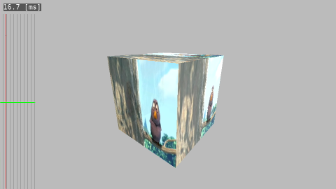

# gl2videocube
Render video stream with FFmpeg-api and OpenGLES.
 - decode video frame and convert it OpenGLES texture.
 - render video texture with 3D transformation.
 - draw a timeseries graph of interval time.

 


## how to build
```
$ sudo apt install libavcodec-dev libavdevice-dev libavfilter-dev libavformat-dev libavresample-dev libavutil-dev
$ make
```

