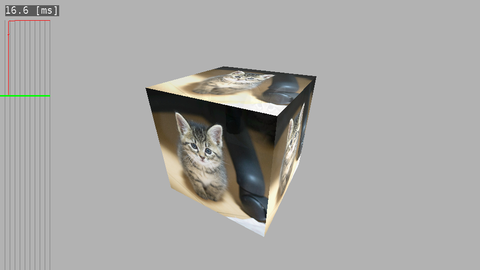

# gl2webcamview
Render video stream with V4L2 and OpenGLES.
 - open "/dev/videoX" for video capture device.
 - capture video image with V4L2 and convert it OpenGLES texture.
 - render video texture with 3D transformation.
 - draw a timeseries graph of interval time.

 
